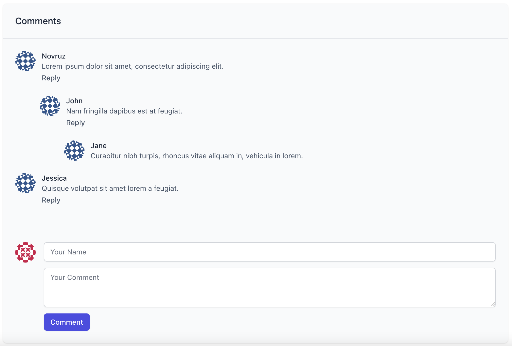

<div align="center">
  <h1>Comment System</h1>
</div>

<div align="center">
  <strong>A commenting system for blogging applications.</strong>
</div>

<div align="center">
  <sub>
    Built with :purple_heart: and :coffee: by <a href="https://twitter.com/nbayramberdiyev">@nbayramberdiyev</a>
  </sub>
</div>

<br />

<div align="center">

[](https://github.com/nbayramberdiyev/comment-system/actions/workflows/ci.yml/badge.svg)

</div>



## Table of Contents

<details open="open">
  <summary>Table of Contents</summary>
  <ol>
    <li>
      <a href="#prerequisites"> ➤ Prerequisites</a>
    </li>
    <li>
      <a href="#installation"> ➤ Installation</a>
    </li>
    <li>
      <a href="#tests"> ➤ Tests</a>
    </li>
  </ol>
</details>

## Prerequisites

- [PHP 8.0](https://www.php.net)
- [Composer](https://getcomposer.org)
- [Node.js](https://nodejs.org/en/)
- [Yarn](https://yarnpkg.com) or [NPM](https://www.npmjs.com)
- [Docker](https://www.docker.com) (Optional)


## Installation

**1. Clone the repository:**

```bash
$ git clone git@github.com:nbayramberdiyev/comment-system.git
```

**2. Go to the project folder:**

```bash
$ cd comment-system
```

**3. Install the (backend) dependencies:**

```bash
$ composer install
```

or if you are using Laravel Sail (Docker) for your local development environment:

```bash
$ ./vendor/bin/sail composer install
```

**4. Create a copy of `.env.example`:**

```bash
$ cp .env.example .env
```

**5. Set the application key:**

```bash
$ php artisan key:generate
```

or if you are using Laravel Sail (Docker) for your local development environment:

```bash
$ ./vendor/bin/sail artisan key:generate
```

**6. Run the database migrations:**

```bash
$ php artisan migrate
```

or if you are using Laravel Sail (Docker) for your local development environment:

```bash
$ ./vendor/bin/sail artisan migrate
```

**7. Install the (frontend) dependencies & compile assets:**

```bash
$ yarn install && yarn dev
```

or if you are using Laravel Sail (Docker) for your local development environment:

```bash
$ ./vendor/bin/sail yarn install && ./vendor/bin/sail yarn dev
```

**8. Start the PHP development server:**

```bash
$ php artisan serve
```

or if you are using Laravel Sail (Docker) for your local development environment:

```bash
$ ./vendor/bin/sail up
```

## Tests

Run the following command:

```bash
$ ./vendor/bin/phpunit
```

or

```bash
$ php artisan test
```
